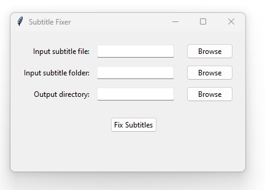

This repository contains a  plugin package for [yt-dlp](https://github.com/yt-dlp/yt-dlp#readme). 
It fixes duplicate lines in YouTube subtitles and saves a additonal srt file called filename.fixed.srt


## Installation

Requires yt-dlp `2023.01.02` or above.

save srt_fix.py under
`C:\Users\{username}\AppData\Roaming\yt-dlp\plugins\srt_fix\yt_dlp_plugins`


You can install this package with pip:
```
python3 -m pip install -U https://github.com/bindestriche/srt_fix/master.zip
```

See [installing yt-dlp plugins](https://github.com/yt-dlp/yt-dlp#installing-plugins) for the other methods this plugin package can be installed.


## usage 

` yt-dlp https://www.youtube.com/xxxx --write-auto-sub  --sub-lang en  --convert-subs=srt  --use-postprocessor srt_fix`


### known issues

#### --skip-downlaod
If you use the `--skip download` argument in yt-dlp the postprocessor is not triggered and no conversion happens.
You can use the tools below for existing srt files.

#### --embed-subtitles
embedding of subtitles is not supported yet. please use another tool to add them yourself. You allready have ffmpeg so you could run:

for one language:
`ffmpeg -i input.mp4 -i ger.srt -c copy -c:s mov_text -strict -2 -metadata:s:s:0 language=ger output-ger.mp4`
replace the language string with the   [ISO 639-2/B language code](https://en.wikipedia.org/wiki/List_of_ISO_639-1_codes) for your subtitles.


for several languages at once you need to use map:
`ffmpeg -i input.mp4 -i input1.srt -i input2.srt -strict -2 -c copy -c:s mov_text -map 0 -map 1 -metadata:s:s:0 language=lang1 -map 2 -metadata:s:s:1 language=lang2 output.mp4`

# srt fixer gui


SRT Fixer is a simple Python-based tool that processes and fixes issues with SRT subtitle files. The tool removes duplicate lines and corrects timing issues in SRT files, which are common problems in YouTube's automatically generated subtitles. The application is built using Python's Tkinter library for an easy-to-use graphical user interface.


* Fix duplicate lines in subtitle files
* Correct overlapping timings
* Process single files or an entire folder of SRT files


## Installation

### Windows
Download the .exe from [release](yt-autosub-srt-fix/releases/tag/subtitles)

### other

install  Python 3.7 or higher
and run
'python srt_fixer_gui.py'

## Usage

Use the "Browse" buttons to select an input file or an input folder containing SRT files.
Select an output folder to save the fixed SRT files.
Click the "Fix Subtitles" button to process and fix the selected subtitle files.
A progress bar will show the progress of the subtitle processing.
Upon completion, a success message will be displayed, and the output folder will open in File Explorer.

# srt fixer cli
If you use `--skip download` the postprocessor is not triggered and no conversion happens. for that case you can use
[srt_fixer_cli.py](srt_fixer_cli.py) to process the files independently.

`python srt_fixer_cli.py brokensubtitle.srt`
will create _brokensubtitle.fixed.srt_ in current folder

usage: `srt_fixer_cli.py [-h] [-o OUTPUT] [-idir INPUT_DIRECTORY] [-odir OUTPUT_DIRECTORY] [input]`

#### positional arguments:

  **input**    Input subtitle file.

#### optional arguments:

  -h, --help            show this help message and exit

  **-o** OUTPUT, --output OUTPUT
                        Output subtitle file.

  **-idir** INPUT_DIRECTORY, --input-directory INPUT_DIRECTORY
                        Input directory containing subtitle files.

  **-odir** OUTPUT_DIRECTORY, --output-directory OUTPUT_DIRECTORY
                        Output directory for processed subtitle files.


